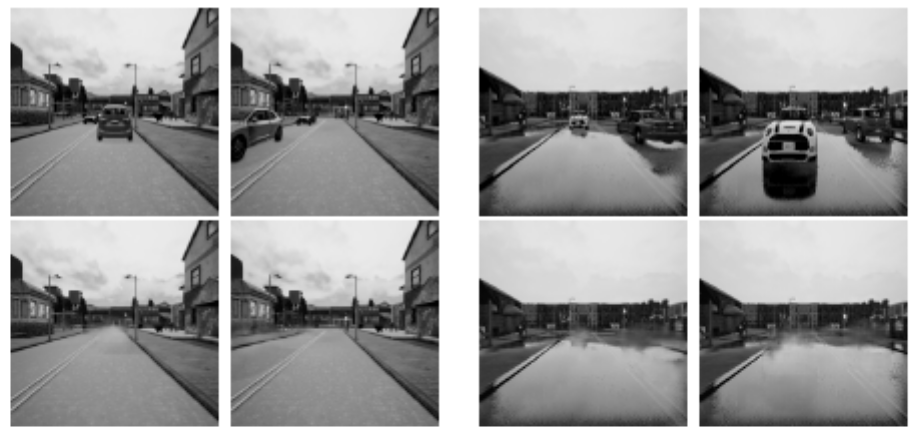

# EmptyCities

[[Project]](https://bertabescos.github.io/EmptyCities/)   [[Paper]]()

Torch implementation for learning a mapping from input images that contain dynamic objects in a city environment, such as vehicles and pedestrians, to output images which are static. In the example below, the top images are fed one by one into our model. The bottom row are the obtained results:



Empty Cities: Image Inpainting for a Dynamic Objects Invariant Space  
[Berta Bescos], [Jose Neira](http://webdiis.unizar.es/~neira/), [Roland Siegwart], [Cesar Cadena](http://n.ethz.ch/~cesarc/)  
CoRL, 2018.

## Setup

### Prerequisites
- Linux or OSX
- NVIDIA GPU + CUDA CuDNN (CPU mode and CUDA without CuDNN may work with minimal modification, but untested)

### Getting Started
- Install torch and dependencies from https://github.com/torch/distro
- Install torch packages `nngraph` and `display`
```bash
luarocks install nngraph
luarocks install https://raw.githubusercontent.com/szym/display/master/display-scm-0.rockspec
```
- Clone this repo:
```bash
git clone git@github.com:BertaBescos/EmptyCities.git
cd EmptyCities
```

### Models
Pre-trained models are found within the folder `/checkpoints`. You might need the GitHub package https://git-lfs.github.com/ to download them.
- `mGAN`: trained only on synthetic data coming from [CARLA](http://carla.org/).
- `mGAN_DA`: trained on synthetic data coming from CARLA with data augmentation.
- `mGAN_RD`: trained on synthectic data coming from CARLA and real data from the Cityscapes dataset. Real data is added during training with a probability of 0.5 from epoch 50 on.
- `SemSeg`: semantic segmentation model. The original model from [ERFNet](https://github.com/Eromera/erfnet) has been finetuned with our data.

## Inference

- You can fastly test our model with one image.
```bash
input=/path/to/input/image/ qlua test.lua
```
We provide some images in `/examples` you can run our model on. For example:
```bash
input=examples/input.png qlua test.lua
```
- You can also store the inpainted result and the binary mask that has been used.
```bash
input=/path/to/input/image/ output=/path/to/output/image/ th test.lua
```
In the following example the binary mask is stored in `/examples/output_mask.png`:
```bash
input=examples/input.png output=examples/output.png th test.lua
```
- If the stored mask is not accurate enough, you can provide yourself a better one:
```bash
input=examples/input.png mask=examples/mask.png output=examples/output.png th test.lua
```

## Test

- If you want to work with more than one image, we encourage you to keep your data in a folder of your choice `/path/to/data/` with three subfolders `train`, `test` and `val`. The following command will run our model within all the images inside the folder `test` and keep the results in `./results/mGAN`. Images within the folder `test` should be RGB images of any size.
```bash
DATA_ROOT=/path/to/data/ th test.lua
```
- If you prefer to feed the dynamic/static binary masks, you should concatenate it to the RGB image. We provide a python script for this.
```bash
DATA_ROOT=/path/to/data/ mask=1 th test.lua
```
- Finally, if the groundtruth images are available you should concatenate them too (RGB | GT | Mask).
```bash
DATA_ROOT=/path/to/data/ mask=1 target=1 th test.lua
```
The test results will be saved to an html file here: `./results/mGAN/latest_net_G_val/index.html`.


## Train

- The simplest case trains only with synthetic CARLA data. In the subfolder `/path/to/synth/data/train/` there should be the concatenated (RGB | GT | Mask) images. The utilized masks come from this simulator too, and therefore do not use the semantic segmentation model.
```bash
DATA_ROOT=/path/to/synth/data/ th train.lua
```
- For better adaptation to real world images it is advisable to train the model with dynamic images from a real city. These images have no groundtruth static image pair, but have groundtruth semantic segmentation. The last one is used to finetune the semantic segmentation network ERFNet for our specific goal. Real data is introduced from `epoch_synth=50` on with a probability of `pNonSynth=0.5`.
```bash
DATA_ROOT=/path/to/synth/data/ NSYTNH_DATA_ROOT=/path/to/real/data/ epoch_synth=50 pNonSynth=0.5 th train.lua
```
- (CPU only) The same training command without using a GPU or CUDNN. Setting the environment variables `gpu=0 cudnn=0` forces CPU only
```bash
DATA_ROOT=/path/to/synth/data/ gpu=0 cudnn=0 th train.lua
```
- (Optionally) start the display server to view results as the model trains. ( See [Display UI](#display-ui) for more details):
```bash
th -ldisplay.start 8000 0.0.0.0
```

Models are saved by default to `./checkpoints/mGAN` (can be changed by passing `checkpoint_dir=your_dir` and `name=your_name` in train.lua).

See `opt` in train.lua for additional training options.

## Datasets
Download the datasets using the following script. Some of the datasets are collected by other researchers. Please cite their papers if you use the data.
```bash
bash ./datasets/download_dataset.sh dataset_name
```
- `facades`: 400 images from [CMP Facades dataset](http://cmp.felk.cvut.cz/~tylecr1/facade/). [[Citation](datasets/bibtex/facades.tex)]
- `cityscapes`: 2975 images from the [Cityscapes training set](https://www.cityscapes-dataset.com/).  [[Citation](datasets/bibtex/cityscapes.tex)]
- `maps`: 1096 training images scraped from Google Maps
- `edges2shoes`: 50k training images from [UT Zappos50K dataset](http://vision.cs.utexas.edu/projects/finegrained/utzap50k/). Edges are computed by [HED](https://github.com/s9xie/hed) edge detector + post-processing.
[[Citation](datasets/bibtex/shoes.tex)]
- `edges2handbags`: 137K Amazon Handbag images from [iGAN project](https://github.com/junyanz/iGAN). Edges are computed by [HED](https://github.com/s9xie/hed) edge detector + post-processing. [[Citation](datasets/bibtex/handbags.tex)]

## Models
Download the pre-trained models with the following script. You need to rename the model (e.g. `facades_label2image` to `/checkpoints/facades/latest_net_G.t7`) after the download has finished.
```bash
bash ./models/download_model.sh model_name
```
- `facades_label2image` (label -> facade): trained on the CMP Facades dataset.
- `cityscapes_label2image` (label -> street scene): trained on the Cityscapes dataset.
- `cityscapes_image2label` (street scene -> label): trained on the Cityscapes dataset.
- `edges2shoes` (edge -> photo): trained on UT Zappos50K dataset.
- `edges2handbags` (edge -> photo): trained on Amazon handbags images.
- `day2night` (daytime scene -> nighttime scene): trained on around 100 [webcams](http://transattr.cs.brown.edu/).

## Setup Training and Test data
### Generating Pairs
We provide a python script to generate training data in the form of pairs of images {A,B}, where A and B are two different depicitions of the same underlying scene. For example, these might be pairs {label map, photo} or {bw image, color image}. Then we can learn to translate A to B or B to A:

Create folder `/path/to/data` with subfolders `A` and `B`. `A` and `B` should each have their own subfolders `train`, `val`, `test`, etc. In `/path/to/data/A/train`, put training images in style A. In `/path/to/data/B/train`, put the corresponding images in style B. Repeat same for other data splits (`val`, `test`, etc).

Corresponding images in a pair {A,B} must be the same size and have the same filename, e.g. `/path/to/data/A/train/1.jpg` is considered to correspond to `/path/to/data/B/train/1.jpg`.

Once the data is formatted this way, call:
```bash
python scripts/combine_A_and_B.py --fold_A /path/to/data/A --fold_B /path/to/data/B --fold_AB /path/to/data
```

This will combine each pair of images (A,B) into a single image file, ready for training.

### Evaluating Labels2Photos on Cityscapes
We provide scripts for running the evaluation of the Labels2Photos task on the Cityscapes validation set. We assume that you have installed `caffe` (and `pycaffe`) in your system. If not, see the [official website](http://caffe.berkeleyvision.org/installation.html) for installation instructions. Once `caffe` is successfully installed, download the pre-trained FCN-8s semantic segmentation model (512MB) by running
```bash
bash ./scripts/eval_cityscapes/download_fcn8s.sh
```
Then make sure `./scripts/eval_cityscapes/` is in your system's python path. If not, run the following command to add it
```bash
export PYTHONPATH=${PYTHONPATH}:./scripts/eval_cityscapes/
```
Now you can run the following command to evaluate your predictions:
```bash
python ./scripts/eval_cityscapes/evaluate.py --cityscapes_dir /path/to/original/cityscapes/dataset/ --result_dir /path/to/your/predictions/ --output_dir /path/to/output/directory/
```
By default, images in your prediction result directory have the same naming convention as the Cityscapes dataset (e.g. `frankfurt_000001_038418_leftImg8bit.png`). The script will output a txt file under `--output_dir` containing the metric.

**Further notes**: The pre-trained model does not work well on Cityscapes in the original resolution (1024x2048) as it was trained on 256x256 images that are resized to 1024x2048. The purpose of the resizing was to 1) keep the label maps in the original high resolution untouched and 2) avoid the need of changing the standard FCN training code for Cityscapes. To get the *ground-truth* numbers in the paper, you need to resize the original Cityscapes images to 256x256 before running the evaluation code.

## Display UI
Optionally, for displaying images during training and test, use the [display package](https://github.com/szym/display).

- Install it with: `luarocks install https://raw.githubusercontent.com/szym/display/master/display-scm-0.rockspec`
- Then start the server with: `th -ldisplay.start`
- Open this URL in your browser: [http://localhost:8000](http://localhost:8000)

By default, the server listens on localhost. Pass `0.0.0.0` to allow external connections on any interface:
```bash
th -ldisplay.start 8000 0.0.0.0
```
Then open `http://(hostname):(port)/` in your browser to load the remote desktop.

L1 error is plotted to the display by default. Set the environment variable `display_plot` to a comma-seperated list of values `errL1`, `errG` and `errD` to visualize the L1, generator, and descriminator error respectively. For example, to plot only the generator and descriminator errors to the display instead of the default L1 error, set `display_plot="errG,errD"`.

## Citation
If you use this code for your research, please cite our paper Empty Cities: Image Inpainting for a Dynamic Objects Invariant Space</a>:

```
@article{emptycities2018,
  title={Empty Cities: Image Inpainting for a Dynamic Objects Invariant Space},
  author={Bescos, Berta and Neira, José and Siegwart, Roland and Cadena, Cesar},
  journal={CoRL},
  year={2019}
}
```

## Acknowledgments
Our code is heavily inspired by [pix2pix](https://github.com/phillipi/pix2pix), [DCGAN](https://github.com/soumith/dcgan.torch) and [Context-Encoder](https://github.com/pathak22/context-encoder).

# EmptyCities
